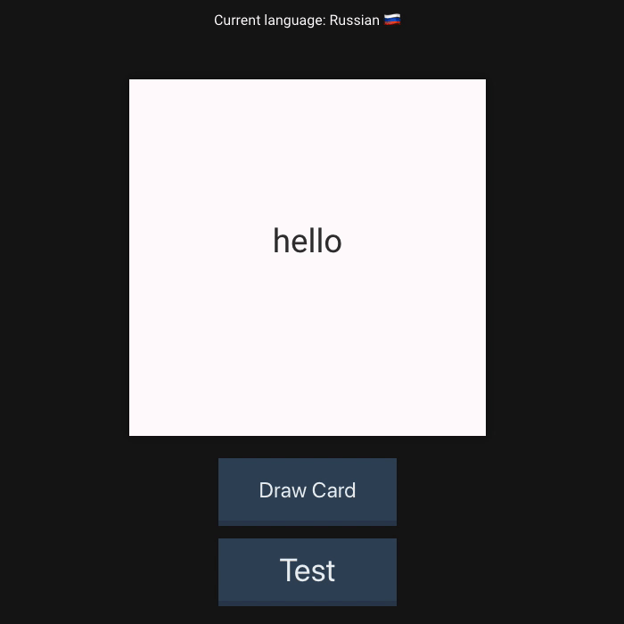

# React Flashcards

This web application was created by [David Stewart](https://github.com/DavidStewartLDN) and [Daria Thompson](https://github.com/dariathompson) application for learning modern languages, built with React, Node.js and PostgreSQL. You can access the live project on [heroku here](https://language-learning-flashcards.herokuapp.com/). 

## Project Status
This project is currently in development. Users can choose between three languages (Mandarin, Russian and Italian) to learn from, add new words and can test their knowledge on the test page.

# Project Structure
## Tech stack

This project uses a React front-end paired with a Node.js backend which is included in this repository. 

Things we learnt in this project:
- How to correctly pass in props to components
- Seperating components into small classes
- Using **React-Context** to have langauge saved as a variable app wide and when changing between pages

  
   

## To Get Started

Clone down this repository. You will need `node` and `npm` installed globally on your machine.  

### To Start Express Server:

To install all node modules that you need run:

`npm install`   

Once you have your modules installed you are ready to start running the Express server that provides access to the database:

`node index.js` 

### To Start React App:

Once you have the server running, navigate to the client folder:

`cd client`

To install the node modules for the React App itself, run:

`npm install`

Once you have installed the node modules you are ready to rumble and start the app:

`npm start`

To visit the app:

`localhost:3000`
